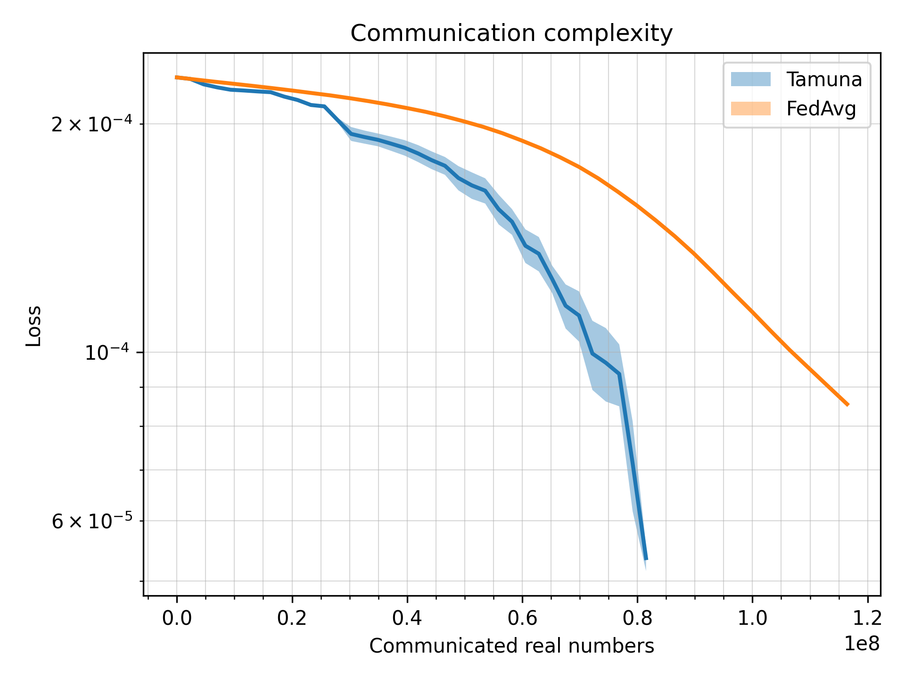
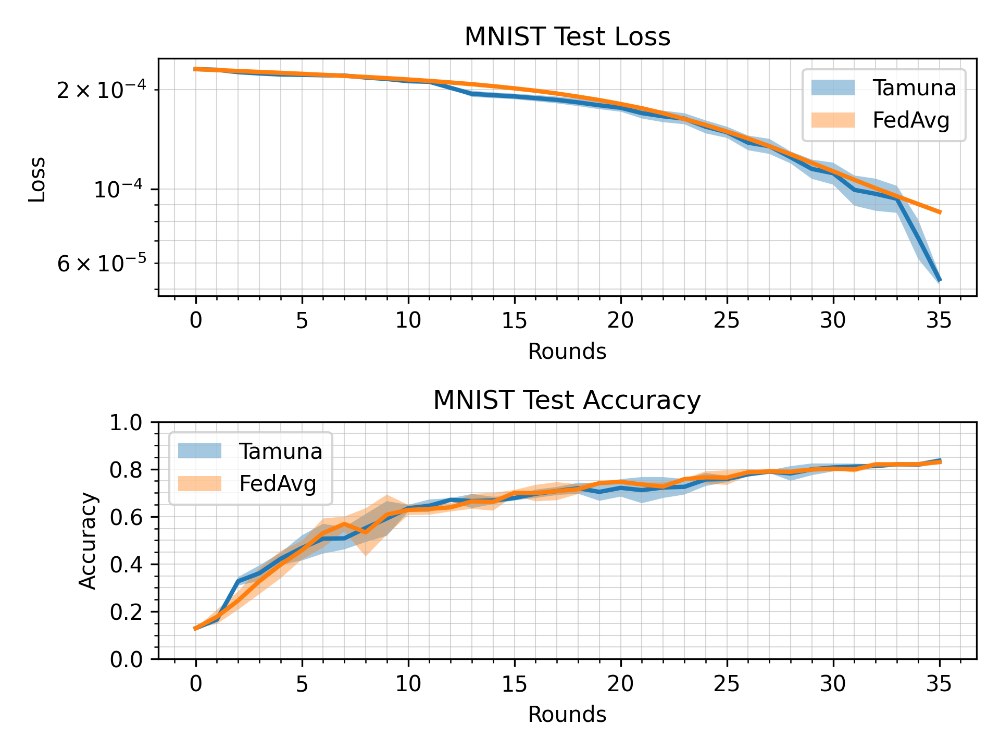

# Tamuna baseline

> Note: If you use this baseline in your work, please remember to cite the original authors of the paper as well as the Flower paper.

****Paper:**** https://arxiv.org/abs/2302.09832

****Authors:**** Laurent Condat, Ivan Agarský, Grigory Malinovsky, Peter Richtárik

****Abstract:**** In federated learning, a large number of users collaborate to learn a global model. They alternate local computations and communication with a distant server. Communication, which can be slow and costly, is the main bottleneck in this setting. In addition to communication-efficiency, a robust algorithm should allow for partial participation, the desirable feature that not all clients need to participate to every round of the training process. To reduce the communication load and therefore accelerate distributed gradient descent, two strategies are popular: 1) communicate less frequently; that is, perform several iterations of local computations between the communication rounds; and 2) communicate compressed information instead of full-dimensional vectors. We propose TAMUNA, the first algorithm for distributed optimization and federated learning, which harnesses these two strategies jointly and allows for partial participation. TAMUNA converges linearly to an exact solution in the strongly convex setting, with a doubly accelerated rate: it provably benefits from the two acceleration mechanisms provided by local training and compression, namely a better dependency on the condition number of the functions and on the model dimension, respectively.


## About this baseline

****What’s implemented:**** The code in this directory compares Tamuna with FedAvg. It produces three plots comparing loss, accuracy and communication complexity of the two algorithms. 

****Datasets:**** MNIST

****Hardware Setup:**** By default, the experiments expect at least one gpu, but this can be changed to cpu only by specifying client and server devices. Default setup less than 5 GB of dedicated GPU memory.

****Contributors:**** Ivan Agarský @Crabzmatic, Grigory Malinovsky @gsmalinovsky


## Experimental Setup

****Task:**** image classification

****Model:**** 

As described in (McMahan, 2017): _Communication-Efficient Learning of Deep Networks from Decentralized Data_ (https://arxiv.org/pdf/1602.05629.pdf)

|     | Layer     | Input Shape  | Output Shape | Param #   | Kernel Shape |
|-----|-----------|--------------|--------------|-----------|--------------|
| Net |           | [1, 28, 28]  | [10]         | --        | --           |
|     | Conv2d    | [1, 28, 28]  | [32, 26, 26] | 832       | [5, 5]       |
|     | MaxPool2d | [32, 26, 26] | [32, 14, 14] | --        | [2, 2]       |
|     | Conv2d    | [32, 14, 14] | [64, 12, 12] | 51,264    | [5, 5]       |
|     | MaxPool2d | [64, 12, 12] | [64, 7, 7]   | --        | [2, 2]       |
|     | Linear    | [3136]       | [512]        | 1,606,144 | --           |
|     | Linear    | [512]        | [10]         | 5,130     | --           |

Total trainable params: 1,663,370

****Dataset:**** By default, training split of MNIST dataset is divided in iid fashion across all 1000 clients, while test split stays on the server for centralized evaluation. Training dataset can also be divided using power law by setting `dataset.iid` to `False` in `base.yaml` config.

****Training Hyperparameters:**** 

| Hyperparameter             | Description                                                                                                                                                                                                                                                 | Default value |
|----------------------------|-------------------------------------------------------------------------------------------------------------------------------------------------------------------------------------------------------------------------------------------------------------|---------------|
| `server.clients_per_round` | Number of active/participating clients each round.                                                                                                                                                                                                          | 10            |
| `server.num_clients`       | Number of total clients.                                                                                                                                                                                                                                    | 1000          |
| `server_num_rounds`        | Number of training rounds, this does not include local training epochs.                                                                                                                                                                                     | 35            |
| `server.s`                 | This describes the level of sparsity in the compression mask, needs to be between 2 and `server.clients_per_round`.                                                                                                                                         | 4             |
| `server.p`                 | Describes the probability of server communication while doing local training, in other words, clients will in expectation do 1/p local epochs. Number of local epochs each rounds is synchronized across clients.                                           | 0.333         |
| `server.uplink_factor`     | Weight of uplink (client to server) communication when calculating communication complexity.                                                                                                                                                                | 1             |
| `server.downlink_factor`   | Weight of downlink (server to client) communication when calculating communication complexity.                                                                                                                                                              | 1             |
| `client.learning_rate`     | Learning rate for client local training.                                                                                                                                                                                                                    | 0.01          |
| `client.eta`               | Learning rate for updating control variates, needs to be between `server.p`/2 and `server.p` * (`server.clients_per_round` * (`server.s` - 1))/(`server.s` * (`server.clients_per_round` - 1)). Usually works very well when simply set to the upper bound. | 0.246         |
| `meta.n_repeats`           | How many times should the training be repeated from the beginning for both Tamuna and FedAvg. Values bigger than 1 will produce plots that show how the randomness affects the algorithms.                                                                  | 3             |   

## Environment Setup

```bash
# Create new conda environment with Python 3.9
conda create -n tamuna python=3.9

# Activate the newly created virtual environment
conda activate tamuna

# Install poetry using pip
pip install poetry

# In some cases there are issues when installing the poetry environment if chardet package is not previously installed
pip install chardet

# Navigate to tamuna directory containing pyproject.toml
# Install all other packages using poetry
poetry install

# Note: If you get and error saying permission/access was denied in the middle of package installations, just rerun the poetry install command. It is most probably a bug in poetry. 
```


## Running the Experiments

Default experimental setup in defined in `conf/base.yaml`, this can be changed if needed.

```bash
poetry run python -m tamuna.main
```

Running time for default experimental setup is around 13min on Intel Core i5-12400F and Nvidia GeForce RTX 3060 Ti, 
while the CPU-only version, which can be found in `conf/base-cpu.yaml`, takes around 20min.


## Expected Results

The resulting directory in `./outputs/` should contain (among other things) `communication_complexity.png` and `loss_accuracy.png`.



